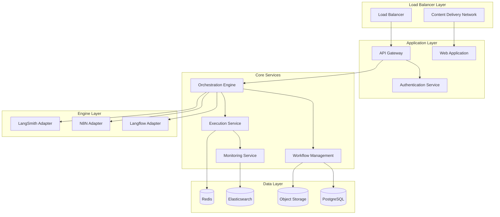

# Deployment Overview

This guide provides a comprehensive overview of deployment options for the Robust AI Orchestrator platform, helping you choose the right deployment strategy for your organization.

## Deployment Options

### 1. Cloud-Hosted (SaaS)
**Best for**: Quick start, minimal maintenance, small to medium teams

**Advantages**:
- No infrastructure management required
- Automatic updates and maintenance
- Built-in security and compliance
- Global availability and CDN
- Pay-as-you-use pricing

**Considerations**:
- Data stored in cloud provider infrastructure
- Limited customization options
- Dependent on internet connectivity
- Shared infrastructure resources

**Getting Started**:
1. Sign up at https://your-orchestrator.com
2. Choose your subscription plan
3. Configure your organization
4. Start creating workflows

### 2. Self-Hosted Cloud
**Best for**: Organizations requiring data control with cloud benefits

**Advantages**:
- Full control over data and infrastructure
- Customizable configuration
- Cloud scalability and reliability
- Integration with existing cloud services
- Compliance with data residency requirements

**Supported Platforms**:
- Amazon Web Services (AWS)
- Microsoft Azure
- Google Cloud Platform (GCP)
- DigitalOcean
- Other cloud providers with Kubernetes support

### 3. On-Premises
**Best for**: Highly regulated industries, air-gapped environments

**Advantages**:
- Complete data control and security
- No external dependencies
- Custom security configurations
- Integration with existing infrastructure
- Compliance with strict regulations

**Requirements**:
- Kubernetes cluster or Docker environment
- Sufficient compute and storage resources
- Network infrastructure and security
- Operational expertise for maintenance

### 4. Hybrid Deployment
**Best for**: Organizations with mixed requirements

**Advantages**:
- Flexibility to place workloads optimally
- Gradual migration strategies
- Compliance with varying data requirements
- Cost optimization across environments

**Scenarios**:
- Development in cloud, production on-premises
- Sensitive data on-premises, general workloads in cloud
- Multi-region deployments for performance
- Disaster recovery across environments

## Architecture Overview

### High-Level Components

### Service Dependencies

#### Core Dependencies
- **PostgreSQL**: Primary database for workflows, users, executions
- **Redis**: Caching, session management, job queues
- **Elasticsearch**: Search, logging, analytics (optional)
- **Object Storage**: File storage, backups, artifacts

#### External Dependencies
- **Langflow**: AI workflow execution engine
- **N8N**: Automation workflow engine
- **LangSmith**: LangChain workflow engine
- **SMTP Server**: Email notifications
- **Identity Provider**: SSO authentication (optional)

## Resource Requirements

### Minimum Requirements (Development)
- **CPU**: 4 cores
- **Memory**: 8GB RAM
- **Storage**: 50GB SSD
- **Network**: 100 Mbps
- **OS**: Linux (Ubuntu 20.04+, CentOS 8+, RHEL 8+)

### Recommended Requirements (Production)
- **CPU**: 16+ cores
- **Memory**: 32GB+ RAM
- **Storage**: 500GB+ SSD
- **Network**: 1 Gbps
- **High Availability**: Multi-node setup

### Scaling Considerations
- **Horizontal Scaling**: Add more nodes for increased capacity
- **Vertical Scaling**: Increase resources per node
- **Auto-Scaling**: Automatic scaling based on demand
- **Load Distribution**: Distribute load across multiple instances

## Security Considerations

### Network Security
- **TLS/SSL**: Encrypt all communications
- **VPN**: Secure network access
- **Firewall**: Restrict network access
- **Network Segmentation**: Isolate components
- **DDoS Protection**: Protect against attacks

### Application Security
- **Authentication**: Multi-factor authentication
- **Authorization**: Role-based access control
- **API Security**: Rate limiting, input validation
- **Data Encryption**: Encrypt sensitive data at rest
- **Audit Logging**: Comprehensive activity logging

### Infrastructure Security
- **OS Hardening**: Secure operating system configuration
- **Container Security**: Secure container images and runtime
- **Secrets Management**: Secure credential storage
- **Vulnerability Scanning**: Regular security assessments
- **Backup Security**: Secure backup storage and encryption

## Deployment Strategies

### Blue-Green Deployment
**Approach**: Maintain two identical production environments

**Process**:
1. Deploy new version to inactive environment (Green)
2. Test thoroughly in Green environment
3. Switch traffic from Blue to Green
4. Keep Blue as rollback option

**Advantages**:
- Zero-downtime deployments
- Easy rollback capability
- Full testing before switch
- Reduced deployment risk

### Rolling Deployment
**Approach**: Gradually replace instances with new version

**Process**:
1. Deploy new version to subset of instances
2. Verify functionality and performance
3. Gradually replace remaining instances
4. Monitor throughout process

**Advantages**:
- Minimal resource overhead
- Gradual risk exposure
- Continuous availability
- Easy to pause or rollback

### Canary Deployment
**Approach**: Deploy to small subset of users first

**Process**:
1. Deploy new version to small percentage of traffic
2. Monitor metrics and user feedback
3. Gradually increase traffic percentage
4. Full deployment or rollback based on results

**Advantages**:
- Early issue detection
- Reduced blast radius
- Data-driven deployment decisions
- User feedback integration

## Monitoring and Observability

### Key Metrics
- **Application Metrics**: Response time, error rate, throughput
- **Infrastructure Metrics**: CPU, memory, disk, network usage
- **Business Metrics**: Workflow executions, user activity
- **Security Metrics**: Failed logins, suspicious activity

### Monitoring Stack
- **Prometheus**: Metrics collection and storage
- **Grafana**: Visualization and dashboards
- **Alertmanager**: Alert routing and management
- **Jaeger**: Distributed tracing
- **ELK Stack**: Log aggregation and analysis

### Alerting Strategy
- **Threshold Alerts**: Based on metric thresholds
- **Anomaly Detection**: Machine learning-based alerts
- **Composite Alerts**: Multiple condition alerts
- **Escalation Policies**: Tiered alert escalation
- **Alert Fatigue Prevention**: Intelligent alert grouping

## Backup and Disaster Recovery

### Backup Strategy
- **Database Backups**: Regular PostgreSQL backups
- **Configuration Backups**: System and application configuration
- **File Backups**: Workflow definitions and artifacts
- **Incremental Backups**: Efficient backup storage
- **Cross-Region Backups**: Geographic distribution

### Disaster Recovery
- **RTO (Recovery Time Objective)**: Target recovery time
- **RPO (Recovery Point Objective)**: Acceptable data loss
- **Failover Procedures**: Automated or manual failover
- **Data Replication**: Real-time or near-real-time replication
- **Testing**: Regular disaster recovery testing

### Business Continuity
- **High Availability**: Multi-zone deployment
- **Load Balancing**: Distribute traffic across instances
- **Health Checks**: Automatic failure detection
- **Circuit Breakers**: Prevent cascade failures
- **Graceful Degradation**: Maintain core functionality

## Compliance and Governance

### Regulatory Compliance
- **SOC 2 Type II**: Security and availability controls
- **GDPR**: Data protection and privacy
- **HIPAA**: Healthcare data protection
- **ISO 27001**: Information security management
- **PCI DSS**: Payment card data security

### Governance Framework
- **Change Management**: Controlled change processes
- **Access Control**: Principle of least privilege
- **Data Classification**: Categorize data sensitivity
- **Policy Enforcement**: Automated policy compliance
- **Audit Trails**: Complete activity logging

### Data Governance
- **Data Residency**: Control data location
- **Data Retention**: Automated data lifecycle management
- **Data Encryption**: Protect data in transit and at rest
- **Data Anonymization**: Protect sensitive information
- **Right to be Forgotten**: Data deletion capabilities

## Cost Optimization

### Resource Optimization
- **Right-Sizing**: Match resources to actual needs
- **Auto-Scaling**: Scale resources based on demand
- **Reserved Instances**: Commit to long-term usage for discounts
- **Spot Instances**: Use spare capacity for non-critical workloads
- **Storage Optimization**: Use appropriate storage tiers

### Operational Efficiency
- **Automation**: Reduce manual operational overhead
- **Monitoring**: Identify and eliminate waste
- **Capacity Planning**: Proactive resource planning
- **Multi-Cloud**: Leverage competitive pricing
- **Cost Allocation**: Track costs by team or project

## Getting Started

### Planning Phase
1. **Requirements Assessment**: Define functional and non-functional requirements
2. **Architecture Design**: Design system architecture and components
3. **Capacity Planning**: Estimate resource requirements
4. **Security Planning**: Define security requirements and controls
5. **Compliance Review**: Ensure regulatory compliance

### Implementation Phase
1. **Infrastructure Setup**: Provision infrastructure resources
2. **Platform Installation**: Deploy Robust AI Orchestrator
3. **Configuration**: Configure system settings and integrations
4. **Testing**: Comprehensive testing of all functionality
5. **Go-Live**: Production deployment and monitoring

### Post-Deployment
1. **Monitoring Setup**: Implement comprehensive monitoring
2. **Backup Configuration**: Set up backup and recovery procedures
3. **Security Hardening**: Apply security best practices
4. **Performance Tuning**: Optimize system performance
5. **Documentation**: Create operational documentation

## Support and Professional Services

### Self-Service Resources
- **Documentation**: Comprehensive deployment guides
- **Community**: Forums and community support
- **Training**: Online training and certification
- **Tools**: Deployment automation tools

### Professional Services
- **Architecture Review**: Expert architecture assessment
- **Implementation Services**: Guided deployment assistance
- **Migration Services**: Migrate from existing platforms
- **Training Services**: Custom training programs
- **Ongoing Support**: Managed services and support

### Support Tiers
- **Community**: Free community support
- **Professional**: Email and chat support
- **Enterprise**: 24/7 phone support and SLA
- **Premium**: Dedicated support team and account management

## Next Steps

1. **Choose Deployment Option**: Select the best deployment strategy for your needs
2. **Review Specific Guides**: Read detailed deployment guides for your chosen platform
3. **Plan Implementation**: Create detailed implementation plan
4. **Engage Support**: Contact professional services if needed
5. **Begin Deployment**: Start with pilot deployment and expand

For detailed deployment instructions, see:
- [Kubernetes Deployment](./kubernetes.md)
- [Docker Deployment](./docker.md)
- [Cloud Deployment Guides](./cloud/)
- [Configuration Reference](./configuration.md)